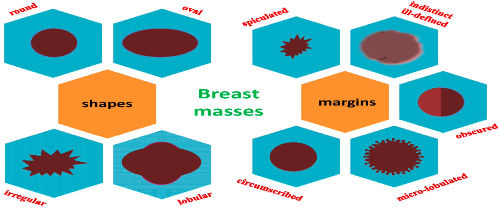

# Breast Cancer Detection Using ULDP: A Computer-Aided Diagnosis (CAD) System

## Overview

This repository implements a **Computer-Aided Diagnosis (CAD) system** for breast cancer detection, inspired by the paper **[‘Analysis of tissue abnormality and breast density in mammographic images using a local directional pattern’](https://www.sciencedirect.com/science/article/abs/pii/S0957417415005321)**. The system uses **Uniform Local Directional Pattern (ULDP)**, a robust feature extraction method, for classifying breast tissues based on density (fatty, glandular, dense) and distinguishing between benign and malignant masses.

  

## Databases

1. **mini-MIAS**:  
   - 322 images (161 women), with mass and normal ROIs.  
   - [Link to mini-MIAS Database](http://peipa.essex.ac.uk/info/mias.html)
   
2. **INbreast**:  
   - 410 digital mammograms from 115 women, with manually extracted mass and normal ROIs.  
   - [Link to INbreast Database](https://www.kaggle.com/datasets/martholi/inbreast)

## ULDP (Uniform Local Directional Pattern)

ULDP is a local descriptor that analyzes pixel neighborhoods using **Kirsch Compass Masks** to capture both edge directions and magnitudes. It improves classification accuracy by incorporating spatial information and normalizing the descriptor using the **L2-norm**.

### Key Steps in ULDP:
1. **Convolution**: Apply Kirsch masks to 3x3 neighborhoods in the image.
2. **Pattern Encoding**: Generate uniform and non-uniform patterns.
3. **Normalization**: Normalize using L2-norm and concatenate histograms from subregions.

## Classifiers

- **Linear SVM (LSVM)** and **Non-Linear SVM (NLSVM)** (RBF kernel).
- **Multi-Class SVM** (for tissue density classification).
- **k-fold Cross-validation** for hyperparameter tuning and performance evaluation.

## Classification Tasks

1. **Mass/Normal Classification**:  
   - **ULDP** outperforms traditional descriptors (e.g., LBP, HoG, GLCM) with **LSVM**, achieving high AUC scores (up to **1.0** on INbreast).
   
2. **Breast Tissue Density Classification**:  
   - Classifies tissue as fatty, glandular, or dense.  
   - Best performance on the mini-MIAS database: **98% accuracy** (fatty/dense classification).

3. **Effect of Breast Density on Mass Classification**:  
   - Analyzes the impact of density (fatty, glandular, dense) on mass/normal classification.

## Practical Implementation

- **Best Results**: ULDP with **LSVM** for mass/normal classification achieved **AUC = 0.93** (mini-MIAS) and **AUC = 0.99** (INbreast).
- For breast density classification, **MLP** outperformed other models with **98% accuracy**.

## Future Work

- Automate **ROI extraction** for a fully automated CAD system.
- Integrate **ultrasound images** for a more comprehensive diagnostic tool.

